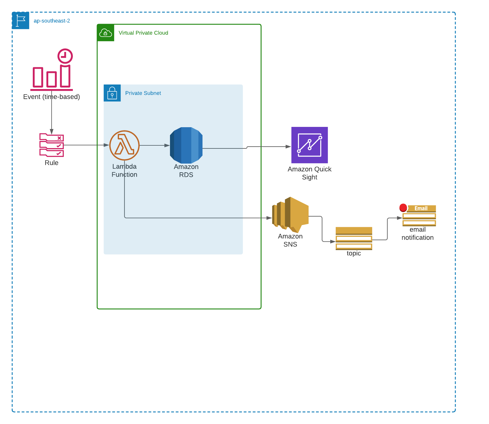

# CloudGuruChallenge

**Goal of the challenge**:  Automate an ETL processing pipeline for COVID-19 data using Python and cloud services.

**Tasks**:

 - [X] Create Architecture
 - [ ] Write Python Script
	 - [X] Fetch Data
	 - [X] Clean Up Data Set
	 - [ ] Modify Data Set to show recovered cases.
	 - [ ] Filter Data
	 - [ ] Code Cleanup
	 - [ ] Tests
 - [ ] Setup Infrastructure
	 - [ ] VPC
	 - [ ] Lambda
	 - [ ] Database
	 - [ ] SNS
	 - [ ] QuickSight (Dashboard)
 - [ ] Write a blog

**Initial Architecture**
